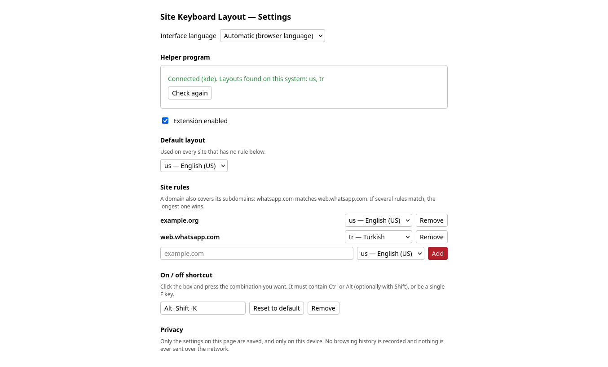

# Site Keyboard Layout

[](https://github.com/trs-1342/site-keyboard-layout/actions/workflows/test.yml)

A Firefox extension that switches your **system keyboard layout** to match the
site in the active tab. Write Turkish on WhatsApp Web and English everywhere
else, German on one site and Russian on another, and never reach for the layout
switcher again.

- Per-site rules (a domain also covers its subdomains) plus a default layout
- Works with whatever layouts your system has; they are detected automatically
- On/off button, configurable keyboard shortcut, per-site pause
- Setup screen on first run; interface in English, Türkçe, Deutsch, Español, Français
- Stores nothing but its own settings, and never talks to the network



## How it works

A browser extension is not allowed to change the system keyboard layout. This
project therefore has two parts:

1. **The extension** (`extension/`) watches which tab is active and decides
   which layout that site should use.
2. **A helper program** (`native/site_keyboard_layout.py`), a small Python
   script that Firefox starts through
   [native messaging](https://developer.mozilla.org/docs/Mozilla/Add-ons/WebExtensions/Native_messaging).
   It performs the actual switch and exits.

The layout is applied every time you change tab or come back to the Firefox
window, and whenever a tab navigates to a site with a different layout. If you
switch the layout by hand, your choice holds while you stay on that tab.

## Supported systems

| System | Status |
| --- | --- |
| Linux, KDE Plasma (Wayland or X11) | Supported and tested (Plasma 6) |
| Windows 10 / 11 | Implemented, experimental |
| GNOME, Sway, Hyprland, other desktops | Not supported yet (contributions welcome) |
| macOS | Not supported |
| Firefox from Flatpak or Snap | Not supported (the sandbox blocks native messaging to host programs) |

Requirements: Firefox 140 or newer, Python 3, and at least two keyboard layouts
configured in your system settings. On Linux, `busctl` (part of systemd) is
also needed.

On KDE, set *System Settings → Keyboard → Layouts → Switching policy* to
**Window** or **Application**. With the *Global* policy the layout chosen for a
site would follow you into other applications.

## Installation

### 1. The extension

Install **Site Keyboard Layout** from
[addons.mozilla.org](https://addons.mozilla.org/firefox/search/?q=Site%20Keyboard%20Layout).
A setup screen opens and shows the one command you need for step 2.

### 2. The helper program

Installed once. The setup screen offers the right download for your system:
open the downloaded file and your system asks for permission and installs it.

| System | Installer |
| --- | --- |
| Fedora, openSUSE | [site-keyboard-layout-helper.rpm](https://github.com/trs-1342/site-keyboard-layout/releases/latest/download/site-keyboard-layout-helper.rpm) |
| Debian, Ubuntu | [site-keyboard-layout-helper.deb](https://github.com/trs-1342/site-keyboard-layout/releases/latest/download/site-keyboard-layout-helper.deb) |
| Windows | [site-keyboard-layout-setup.cmd](https://github.com/trs-1342/site-keyboard-layout/releases/latest/download/site-keyboard-layout-setup.cmd) (Python 3 must be installed) |

A browser extension cannot install software or ask for administrator rights
itself, which is why this step happens outside Firefox.

Or use one command in a terminal:

**Linux (KDE Plasma)**

```sh
curl -fsSL https://raw.githubusercontent.com/trs-1342/site-keyboard-layout/v2.0.3/native/install.sh | sudo bash
```

**Windows** (PowerShell, no administrator rights needed; Python 3 must be installed)

```powershell
irm https://raw.githubusercontent.com/trs-1342/site-keyboard-layout/v2.0.3/native/install.ps1 | iex
```

The installer downloads a single Python file from the same release, verifies
its SHA-256 checksum and registers it with Firefox. Then press *Check again*
on the setup screen.

Prefer to read before you run? Clone the repository and run the same script
from the checkout:

```sh
sudo ./native/install.sh --system     # all users
./native/install.sh --user            # current user only, needs ~/.mozilla
```

```powershell
powershell -ExecutionPolicy Bypass -File .\native\install.ps1
```

Recent Firefox versions keep their profile in `~/.config/mozilla` and have no
`~/.mozilla`; those systems need the system-wide install, which is why the
one-line command uses `sudo`.

To let the extension work in private windows too, enable *Run in Private
Windows* for it in `about:addons`.

### Uninstalling

Remove the extension in `about:addons`. Then remove the helper the way you
installed it: uninstall the `site-keyboard-layout-helper` package, or run
`native/uninstall.sh` (with `sudo` for a system install) or
`native\uninstall.ps1`.

## Privacy

- **Saved on your device:** whether the extension is on, the default layout,
  your site rules and the interface language. That is all
  (`browser.storage.local`).
- **Kept in memory until Firefox closes:** the sites you paused from the popup,
  and which tab number last got which layout. No site names are kept for the
  latter. Private windows cannot be paused, so nothing about them is kept.
- **Never:** no browsing history, no logs, no analytics, no network requests.
  The extension pages run under a content security policy that forbids any
  network connection, and the extension requests no host permissions, so it
  cannot read or modify page content.
- The `tabs` permission is used for one thing: reading the address of the
  active tab to find its domain.
- The helper program writes no files and keeps no logs.

## Security

- The helper program only accepts two commands (`status`, `set`) and only
  switches to layouts that are already configured on the system. Layout names
  are validated against a strict pattern and never passed through a shell.
- Firefox only lets this extension's ID talk to the helper
  (`allowed_extensions`), and the helper checks the caller ID again itself.
- Messages are limited to 4 KB; malformed input is rejected.
- Settings read back from storage are validated before use.
- With a system install the helper is owned by root and not writable by
  regular users.

Please report security problems privately through the repository's
"Report a vulnerability" button rather than in a public issue.

## Development

```sh
python3 -m unittest discover tests     # helper program
node --test tests/common.test.js       # extension helpers
npx web-ext lint -s extension          # manifest and code checks
npx web-ext run -s extension           # try it in a temporary profile
```

Building a signed package needs your own
[AMO API credentials](https://addons.mozilla.org/developers/addon/api/key/):

```sh
npx web-ext sign -s extension --channel=unlisted \
  --api-key="$AMO_JWT_ISSUER" --api-secret="$AMO_JWT_SECRET"
```

If you fork the project, change the extension ID in `extension/manifest.json`,
`native/site_keyboard_layout.py` and the install scripts.

`packaging/build.sh` builds the installers into `dist/`.

A release is: bump the version in `extension/manifest.json`, the helper and
both install scripts, update the checksum in the install scripts
(`sha256sum native/site_keyboard_layout.py`; the tests check all of this), and
tag the commit `vX.Y.Z` and attach the files from `dist/` to the release, so
the download buttons and one-line installers resolve.

### Adding a desktop

Backends live in `native/site_keyboard_layout.py`. A backend is a class with
`layouts()`, `current_index()` and `set_index(index)`; see `KdeBackend`.

### Adding a language

Copy the `en` block in `extension/locales.js`, translate it and add the
language to `LANGUAGES`. Add a matching `extension/_locales/<code>/messages.json`
for the name and description shown in the add-ons manager.

## License

Copyright (C) 2026 trs-1342

This program is free software: you can redistribute it and/or modify it under
the terms of the GNU General Public License version 3 as published by the Free
Software Foundation. It is distributed without any warranty. See
[LICENSE](LICENSE).
